# lab4

**<p>Nama: Ridho Pikriyansyah</p>**
**<p>Kelas: TI.21.A.3</p>**
**<p>NIM: 312110169</p>**

## .htaccess

```
<IfModule mod_rewrite.c>
    RewriteEngine On
    RewriteBase /tugas/lab4/
    RewriteCond %{REQUEST_FILENAME} !-f
    RewriteCond %{REQUEST_FILENAME} !-d
    RewriteRule ^(.*)$\/?$ index.php?mod=$1 [L,QSA]
</IfModule>
```

# _Praktikum 4_

## index.php

```
<?php

$mod = @$_REQUEST['mod'];

switch ($mod) {
    case "home":
        require("home.php");
        break;
    case "about":
        require("about.php");
        break;
    case "contact":
        require("contact.php");
        break;
    default:
        require("home.php");
}

```

## home.php

### Output

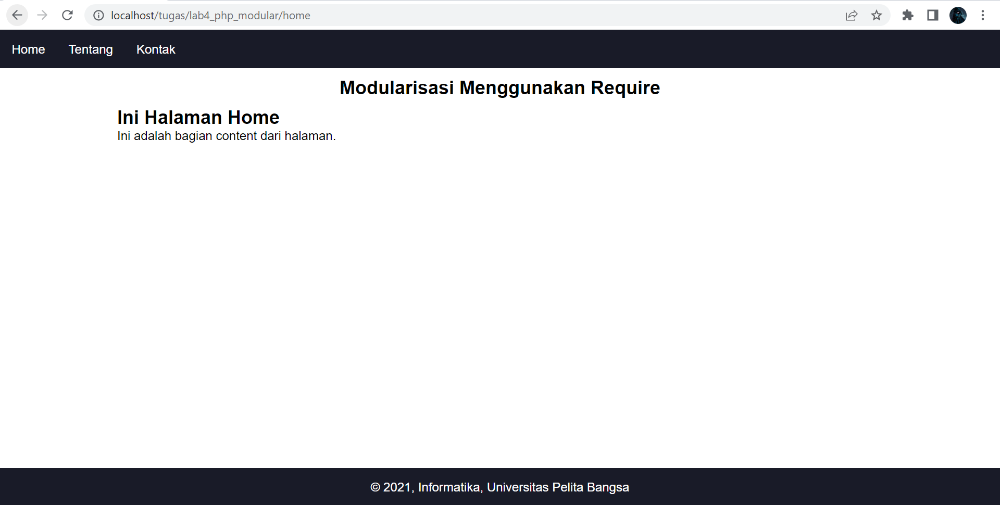

### Code

```
<?php require('header.php'); ?>
<div class="content">
    <h2>Ini Halaman Home</h2>
    <p>Ini adalah bagian content dari halaman.</p>
</div>
<?php require('footer.php'); ?>
```

## about.php

### Output

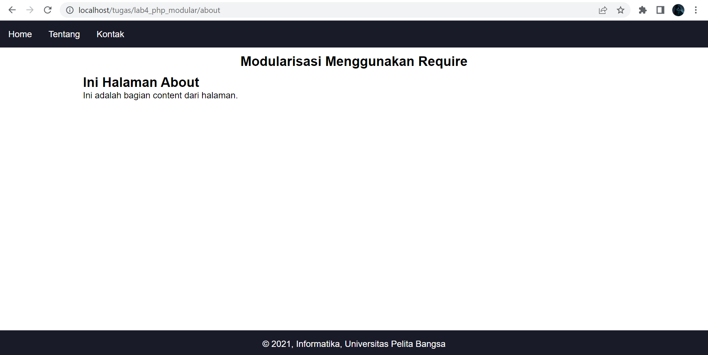

### Code

```
<?php require('header.php'); ?>
<div class="content">
    <h2>Ini Halaman About</h2>
    <p>Ini adalah bagian content dari halaman.</p>
</div>
<?php require('footer.php'); ?>
```

## contant.php

### Output

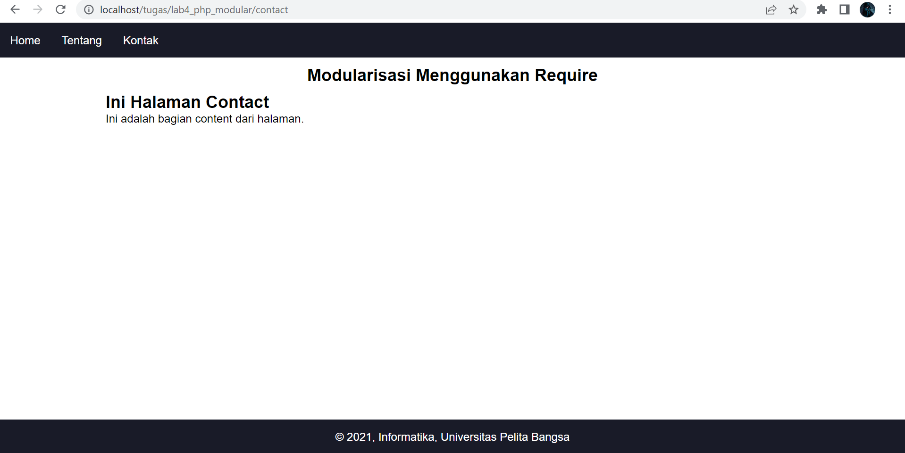

### code

```
<?php require('header.php'); ?>
<div class="content">
    <h2>Ini Halaman Contact</h2>
    <p>Ini adalah bagian content dari halaman.</p>
</div>
<?php require('footer.php'); ?>
```

# _Tugas konsep modularisasi pada kode program lab3web_

## index.php

```
<?php

require_once("./include/header.php");
require_once("./required/function.php");

$mod = strpos(@$_REQUEST["mod"], "/") ? str_split(@$_REQUEST["mod"], strpos(@$_REQUEST["mod"], "/"))[0] : @$_REQUEST['mod'];

switch ($mod) {
    case "tambah":
        $page = 'tambah';
        break;
    case "rumah":
    case "":
        $page = 'rumah';
        break;
    case "ubah":
        $page =  'ubah';
        break;
    case "hapus":
        $page = "hapus";
        break;
    case "tentang":
        $page = "tentang";
        break;
    case "kontak":
        $page = "kontak";
        break;
    default:
        $page = 'error';
        break;
}

require $page . '.php';

require_once("./include/footer.php");

```

## rumah.php

### Output

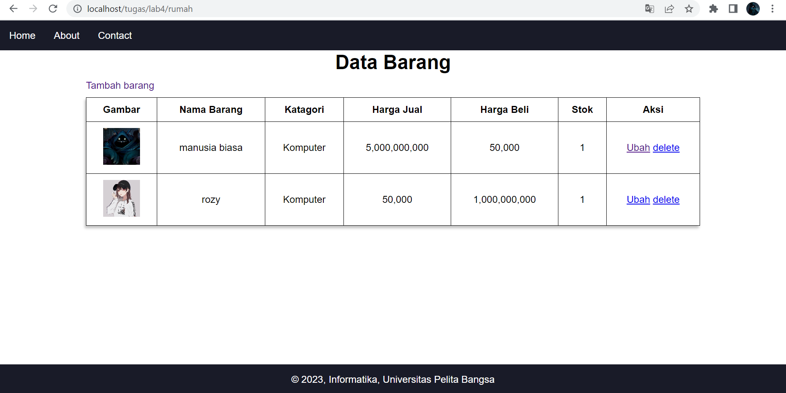

### Code

```
<?php
$sql = 'SELECT * FROM data_barang';
$result = mysqli_query($conn, $sql);
?>

<div class="main">
    <h1>Data Barang</h1>
    <a class="tambah" href="tambah">Tambah barang</a>
    <table>
        <tr>
            <th>Gambar</th>
            <th>Nama Barang</th>
            <th>Katagori</th>
            <th>Harga Jual</th>
            <th>Harga Beli</th>
            <th>Stok</th>
            <th>Aksi</th>
        </tr>
        <?php if ($result) : ?>
            <?php while ($row = mysqli_fetch_array($result)) : ?>
                <tr>
                    <td>" alt="<?= $row['gambar']; ?>"></td>
                    <td><?= $row['nama']; ?></td>
                    <td><?= $row['kategori']; ?></td>
                    <td><?= number_format($row['harga_beli']); ?></td>
                    <td><?= number_format($row['harga_jual']); ?></td>
                    <td><?= $row['stok']; ?></td>
                    <td><a href="ubah/<?= $row['id_barang']; ?>">Ubah</a> <a href="hapus/<?= $row["id_barang"]; ?>">delete</a></td>
                </tr>
            <?php endwhile;
        else : ?>
            <tr>
                <td colspan="7">Belum ada data</td>
            </tr>
        <?php endif; ?>
    </table>
</div>
```

## tentang.php

### Output

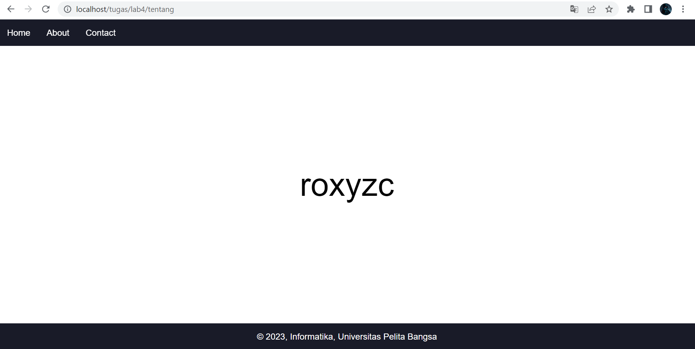

### Code

```
<div class="main">
    <div class="about">
        <p class="error">roxyzc</p>
    </div>
</div>
```

## kontak.php

### Output

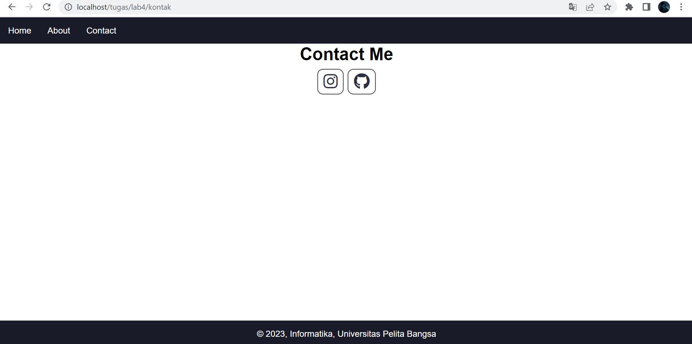

### Code

```
<div class="main">
    <h1>Contact Me</h1>
    <div class="contact">
        <a target="_blank" class="instagram" href="https://www.instagram.com/ridh15_/"><i class="fa-brands fa-instagram"></i></a>
        <a target="_blank" class="github" href="https://github.com/roxyzc"><i class="fa-brands fa-github"></i></a>
    </div>
</div>
```

## tambah.php

### Output

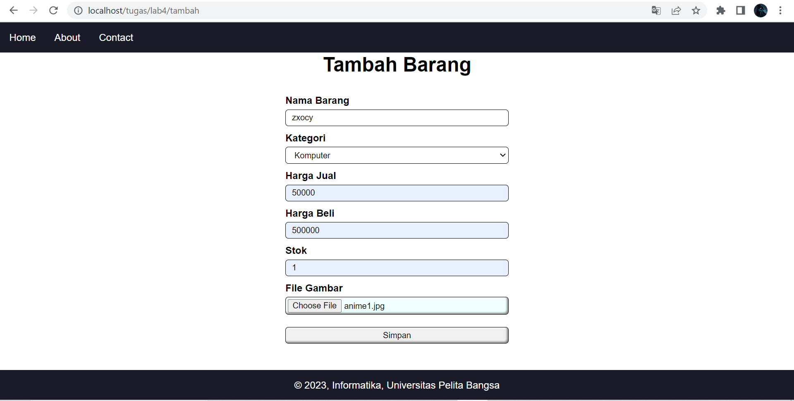

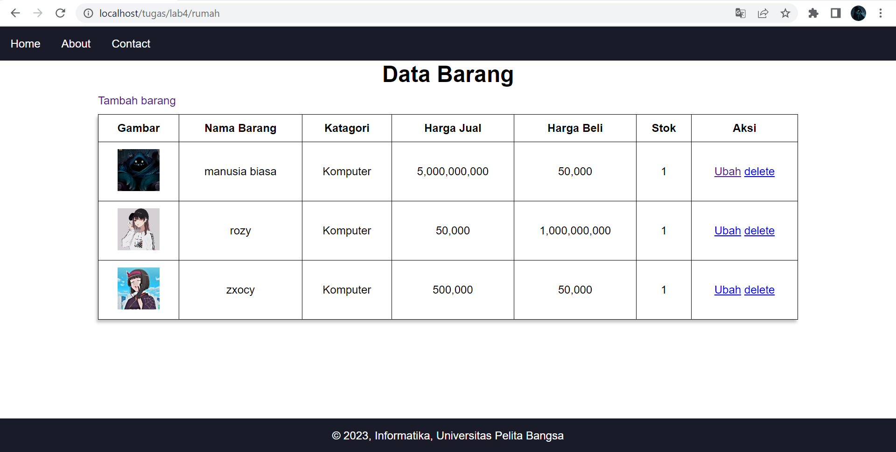

### Code

```
<?php
$sql = 'SELECT * FROM data_barang';
$result = mysqli_query($conn, $sql);
?>

<div class="main">
    <h1>Data Barang</h1>
    <a class="tambah" href="tambah">Tambah barang</a>
    <table>
        <tr>
            <th>Gambar</th>
            <th>Nama Barang</th>
            <th>Katagori</th>
            <th>Harga Jual</th>
            <th>Harga Beli</th>
            <th>Stok</th>
            <th>Aksi</th>
        </tr>
        <?php if ($result) : ?>
            <?php while ($row = mysqli_fetch_array($result)) : ?>
                <tr>
                    <td>" alt="<?= $row['gambar']; ?>"></td>
                    <td><?= $row['nama']; ?></td>
                    <td><?= $row['kategori']; ?></td>
                    <td><?= number_format($row['harga_beli']); ?></td>
                    <td><?= number_format($row['harga_jual']); ?></td>
                    <td><?= $row['stok']; ?></td>
                    <td><a href="ubah/<?= $row['id_barang']; ?>">Ubah</a> <a href="hapus/<?= $row["id_barang"]; ?>">delete</a></td>
                </tr>
            <?php endwhile;
        else : ?>
            <tr>
                <td colspan="7">Belum ada data</td>
            </tr>
        <?php endif; ?>
    </table>
</div>
```

## ubah.php

### Output

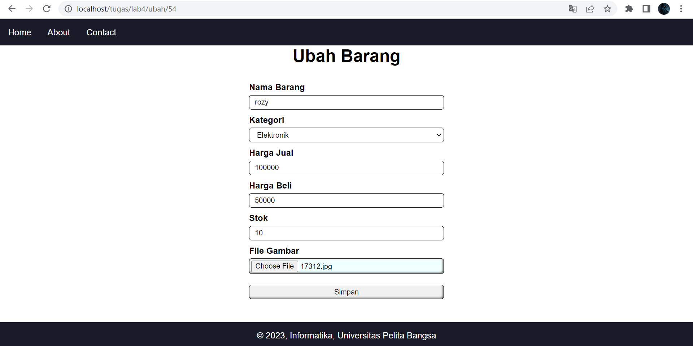

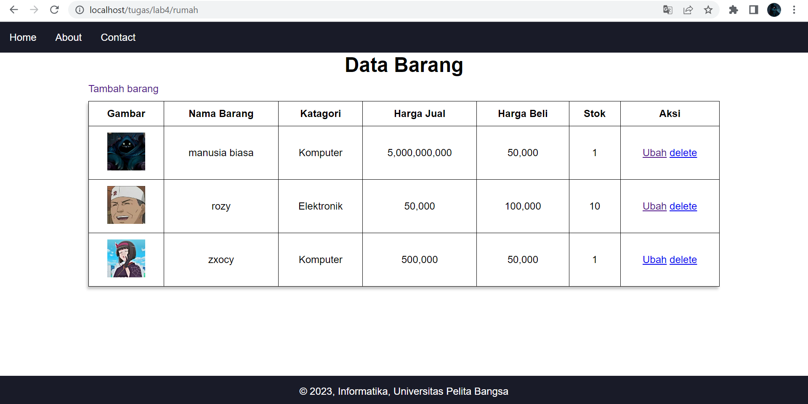

### Code

```
$id = strpos(@$_REQUEST["mod"], "/") ? str_split(@$_REQUEST["mod"], strpos(@$_REQUEST["mod"], "/") + 1)[1] : @$_REQUEST['mod'];
$sql = "SELECT * FROM data_barang WHERE id_barang = '{$id}'";
$result = mysqli_query($conn, $sql);
if (mysqli_num_rows($result) == 0) {
    die('Error: Data tidak tersedia');
} else {
    $data = mysqli_fetch_array($result);
}

function is_select($var, $val)
{
    if ($var == $val) return 'selected="selected"';
    return false;
}

?>

<h1>Ubah Barang</h1>
<div class="main">
    <form method="post" action="../ubah" enctype="multipart/form-data">
        <div class="input">
            <label>Nama Barang</label>
            <input type="text" maxlength="30" name="nama" value="<?php echo $data['nama']; ?>" />
        </div>
        <div class="input">
            <label>Kategori</label>
            <select name="kategori">
                <option <?php echo is_select('Komputer', $data['kategori']); ?> value="Komputer">Komputer</option>
                <option <?php echo is_select('Komputer', $data['kategori']); ?> value="Elektronik">Elektronik</option>
                <option <?php echo is_select('Komputer', $data['kategori']); ?> value="Hand Phone">Hand Phone</option>
            </select>
        </div>
        <div class="input">
            <label>Harga Jual</label>
            <input type="text" maxlength="10" name="harga_jual" value="<?php echo $data['harga_jual']; ?>" />
        </div>
        <div class="input">
            <label>Harga Beli</label>
            <input type="text" maxlength="10" name="harga_beli" value="<?php echo $data['harga_beli']; ?>" />
        </div>
        <div class="input">
            <label>Stok</label>
            <input type="text" maxlength="10" name="stok" value="<?php echo $data['stok']; ?>" />
        </div>
        <div class="input">
            <label>File Gambar</label>
            <div class="label">
                <input type="file" name="file_gambar" />
            </div>
        </div>
        <div class="submit">
            <input type="hidden" name="id" value="<?php echo $data['id_barang']; ?>" />
            <input type="submit" name="ubah" value="Simpan" />
        </div>
    </form>
</div>
```

## hapus.php

### Output _Sebelum dihapus_

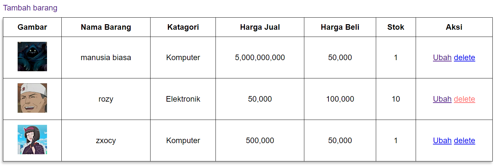

### Output _Sesudah dihapus_

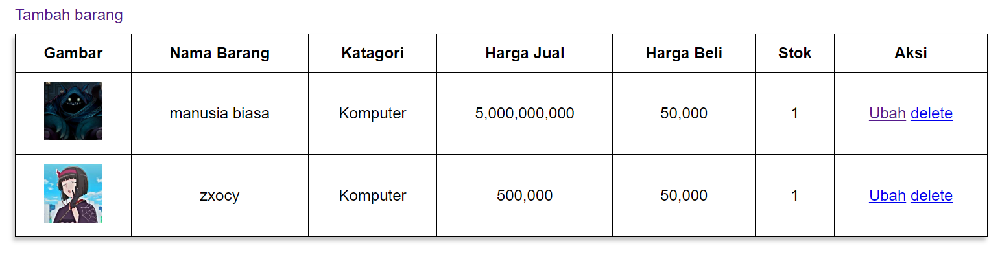

### Code

```
<?php
$id = strpos(@$_REQUEST["mod"], "/") ? str_split(@$_REQUEST["mod"], strpos(@$_REQUEST["mod"], "/") + 1)[1] : @$_REQUEST['mod'];
$sql = "DELETE FROM data_barang WHERE id_barang = '{$id}'";
$result = mysqli_query($conn, $sql);

header('location: ../rumah');
```
